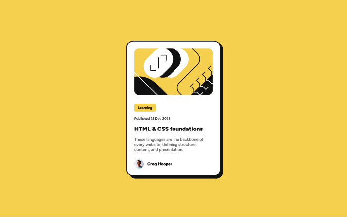
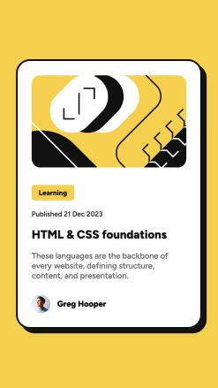

# Blog Preview Card

This is my solution to the **Blog Preview Card Challenge** from [Frontend Mentor](https://www.frontendmentor.io/challenges). This project helped me practice creating responsive layouts and styling interactive elements.

---

## Features

- Fully responsive design.
- Hover states for all interactive elements.
- Clean and simple layout.

---

## Built With

- **HTML5**: Semantic and accessible markup.
- **CSS3**: Custom properties, Flexbox for layout, and hover effects.
- **Mobile-first workflow**: Ensures the design works on smaller devices first.

---

## Preview

### Desktop View



### Mobile View  


---

## Links

- **Live Demo**: [View Live Site](https://6mario13.github.io/frontend-mentor-challenges/blog-preview-card/)
- **Solution on Frontend Mentor**: [View Solution](https://www.frontendmentor.io/solutions?tab=all)

---

## Installation

To run the project locally:

1. Clone the repository:
   ```bash
   git clone https://github.com/6Mario13/frontend-mentor-challenges.git
   ```
2. Navigate to the project folder:
   ```bash
   cd frontend_mentor_challenges/blog-preview-card
   ```
3. Open the `index.html` file in your browser.

---

## Challenges Faced

This project allowed me to improve:
- Writing clean and maintainable CSS.
- Using Flexbox to create a responsive card layout.
- Managing hover states for interactive elements.

---

## Future Improvements

- Optimize for larger screens with additional design details.
- Add smooth animations for hover effects.

---

## Author

- Frontend Mentor: [@6Mario13](https://www.frontendmentor.io/profile/6Mario13)
- GitHub: [@6Mario13](https://github.com/6Mario13)