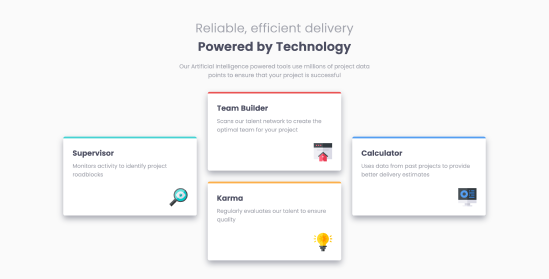
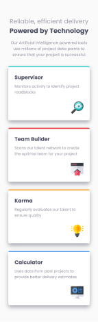

# Four Card Feature Section

This is my solution to the **Four Card Feature Section Challenge** from [Frontend Mentor](https://www.frontendmentor.io/challenges). This project helped me practice building modern, responsive layouts and component-based designs using HTML and CSS.

---

## Features

- Responsive layout using **CSS Grid and Flexbox**.
- Clean, modern card components with SVG icon.
- Consistent spacing and alignment for a visually appealing design.

---

## Built With

- **HTML5**: Semantic and accessible structure.
- **CSS3**: Grid layout for organizing the cards and Flexbox for alignment.
- **Mobile-first workflow**: Ensures the design is optimized for smaller screens first.

---

## Preview

### Desktop View



### Mobile View  


---

## Links

- **Live Demo**: [View Live Site](https://6Mario13.github.io/four-card-feature-section/)
- **Solution on Frontend Mentor**: [View Solution](https://www.frontendmentor.io/solutions/your-solution-link)

---

## Installation

To run the project locally:

1. Clone the repository:
   ```bash
   git clone https://github.com/6Mario13/frontend-mentor-challenges.git
   ```
2. Navigate to the project folder:
   ```bash
   cd four-card-feature-section
   ```
3. Open the `index.html` file in your browser.

---

## Challenges Faced

This project helped me enhance the following skills:
- Creating responsive layouts with **Flexbox** and **Grid**.
- Positioning elements within cards (e.g., icons at the bottom-right corner).
- Adding subtle color accents and clean typography for visual hierarchy.
- Ensuring consistency across different screen sizes.

---

## Author

- Frontend Mentor: [@6Mario13](https://www.frontendmentor.io/profile/6Mario13)
- GitHub: [@6Mario13](https://github.com/6Mario13)