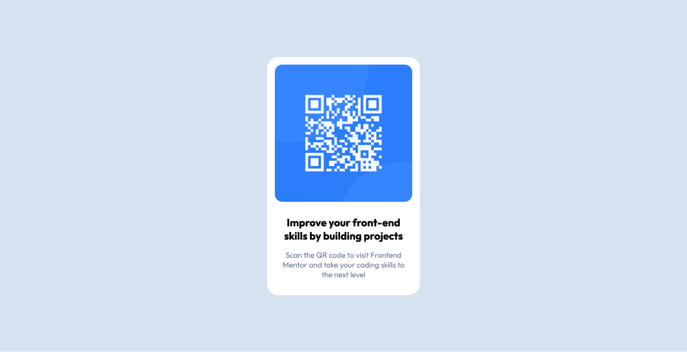

# Frontend Mentor - QR code component solution

This is a solution to the [QR code component challenge on Frontend Mentor](https://www.frontendmentor.io/challenges/qr-code-component-iux_sIO_H). 

## Table of contents

- [Overview](#overview)
  - [Screenshot](#screenshot)
  - [Links](#links)
- [My process](#my-process)
  - [Built with](#built-with)
  - [Features](#features)
  - [Useful resources](#useful-resources)
- [Author](#author)

## Overview

This project is based on Frontend Mentor's QR code component challenge.
The goal is to implement a QR code component by referring to the given design.

### Screenshot

### Links

- GitHub: [qr code component](https://github.com/6Mario13/frontend-mentor-challenges/tree/main/qr-code-component)
- Live Demo: [View Live Site](https://6mario13.github.io/frontend-mentor-challenges/blog-preview-card/)
- Solution on Frontend Mentor: [View Solution](https://www.frontendmentor.io/solutions/qr-code-component-built-with-html-and-css-o381FMKSAQ)

## My process

### Built with

- HTML
- CSS

### Features

- Responsive design
- Clean and minimalistic layout
- Perfectly centered component
- Design matches the provided challenge layout

### Useful resources

- [learn HTML](https://developer.mozilla.org/en-US/docs/Learn/HTML)
- [learn CCS](https://developer.mozilla.org/en-US/docs/Learn/CSS)

## Author

- GitHub - [6Mario13](https://github.com/6Mario13)
- Frontend Mentor - [6Mario13](https://www.frontendmentor.io/profile/6Mario13)