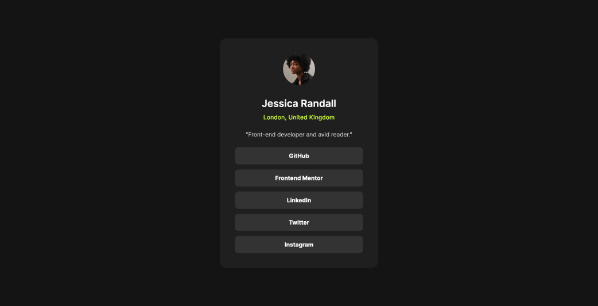
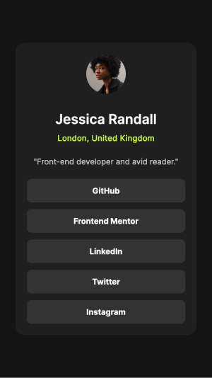

# Social Links Profile

This is my solution to the **Social Links Profile Challenge** from [Frontend Mentor](https://www.frontendmentor.io/). This project helped me practice creating accessible and responsive layouts while ensuring semantic HTML and CSS are used effectively.

---

## Features

- **Responsive Design**: Adjusts seamlessly to various screen sizes.
- **Keyboard Navigation**: Fully accessible using the `Tab` key for navigation.
- **Semantic HTML**: Uses appropriate tags to improve structure and accessibility.
- **Custom Hover and Focus Effects**: Adds interactivity to social media links.

---

## Built With

- **HTML5**: Semantic and accessible structure.
- **CSS3**: Flexbox, custom properties, and responsive design techniques.
- **Mobile-first Workflow**: Optimized for smaller devices first.

---

## Preview

### Desktop View



### Mobile View  


---

## Links

- **Live Demo**: [View Live Site](https://6mario13.github.io/frontend-mentor-challenges/social-links-profile/)
- **Solution on Frontend Mentor**: [View Solution](https://www.frontendmentor.io/solutions/social-links-profile-based-on-html-and-css-Mna66iAW8X)

---

## Installation

To run the project locally:

1. Clone the repository:
   ```bash
   git clone https://github.com/6Mario13/frontend-mentor-challenges.git
   ```
2. Navigate to the project folder:
   ```bash
   cd frontend_mentor_challenges/social-links-profile
   ```
3. Open the `index.html` file in your browser.

---

## Challenges Faced

This project helped me:

- Improve understanding of Flexbox for layout alignment.
- Learn how to add keyboard accessibility without JavaScript.
- Practice styling hover and focus states effectively.

---

## Author

- Frontend Mentor: [@6Mario13](https://www.frontendmentor.io/profile/6Mario13)
- GitHub: [@6Mario13](https://github.com/6Mario13)