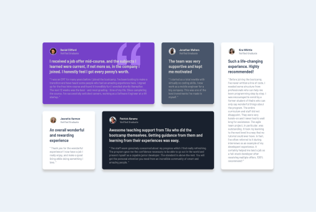

# Testimonials Grid Section

This is my solution to the **Testimonials Grid Section Challenge** from [Frontend Mentor](https://www.frontendmentor.io/challenges). This project allowed me to practice building responsive layouts and organizing content in an engaging grid format using HTML and CSS.

---

## Features

- Responsive grid layout designed with **CSS Grid**.
- Clean typography and consistent spacing for better readability.
- Aesthetic color palette.

---

## Built With

- **HTML5**: Accessible, semantic markup structure.
- **CSS3**: Grid layout for the testimonials section and styling for visual hierarchy.
- **Mobile-first approach**: Optimized design starting with smaller screens.

---

## Preview

### Desktop View



### Mobile View


---

## Links

- **Live Demo**: [View Live Site](https://6mario13.github.io/frontend-mentor-challenges/testimonials-grid-section/)
- **Solution on Frontend Mentor**: [View Solution](https://www.frontendmentor.io/solutions/your-solution-link)

---

## Installation

To run the project locally:

1. Clone the repository:
   ```bash
   git clone https://github.com/6Mario13/frontend-mentor-challenges.git
   ```
2. Navigate to the project folder:
   ```bash
   cd testimonials-grid-section
   ```
3. Open the `index.html` file in your browser.

---

## Challenges Faced

This challenge helped me improve in the following areas:
- Utilizing **CSS Grid** for complex layouts and ensuring proper alignment.
- Fine-tuning spacing, padding, and margin for a polished appearance.
- Maintaining design consistency across different screen sizes.

---

## Author

- Frontend Mentor: [@6Mario13](https://www.frontendmentor.io/profile/6Mario13)
- GitHub: [@6Mario13](https://github.com/6Mario13)
